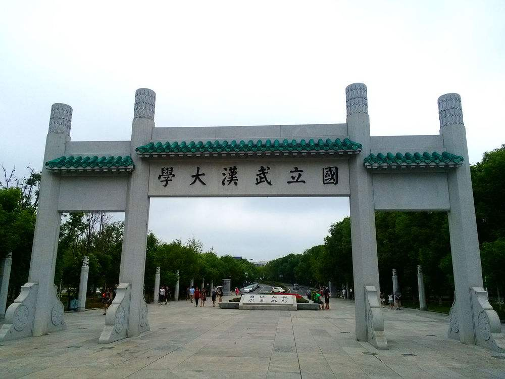
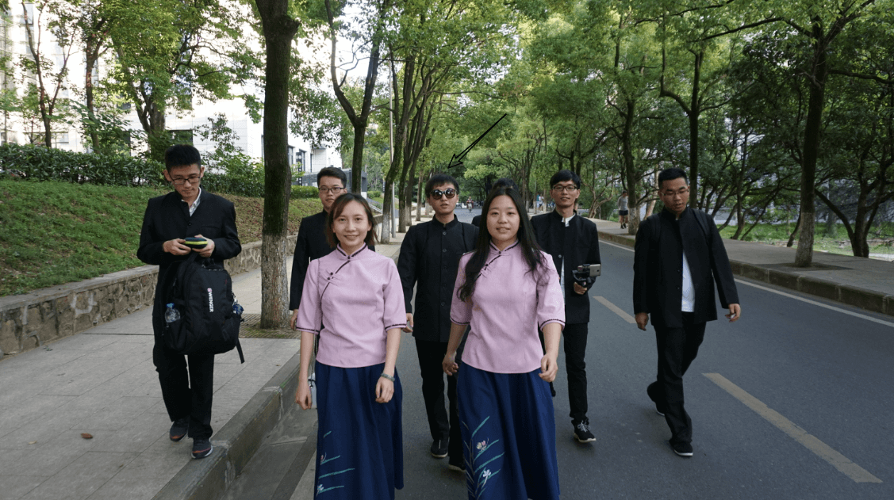
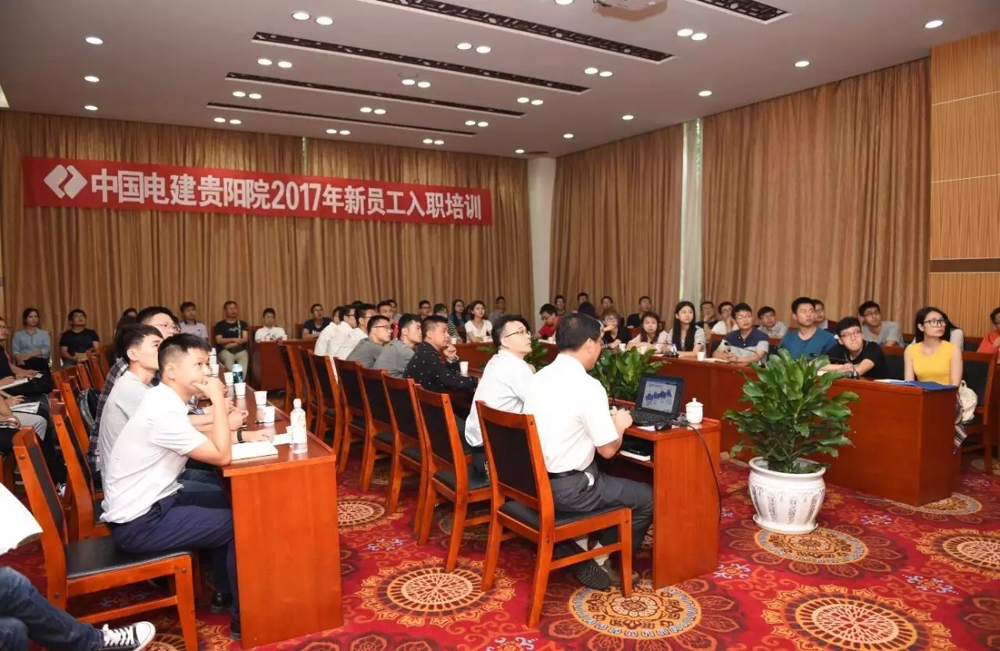

---?image=assets/images/qrcode.png&position=right 10% bottom 10%&size=10% auto
<h1 style="font-family:'STXinwei';">@color[#e49436](青春)代表作</h1> 

Presented by @size[1.2em](@color[#e49436](李扬杰))

@size[0.4em](https://gitpitch.com/YazidLee/YouthRepresentation/master)

---
@transition[concave-in fade-out]
## @fa[graduation-cap](入职)
+++
@snap[north]
<h2>@size[0.5em](@color[#e49436](入职)——Hello，贵阳院！)</h2>
@snapend
@snap[west sidebar]

@snap[midpoint]
@fa[angle-double-right fa-5x]
@snapend
@snapend
@snap[east sidebar]

@snapend

+++

@snap[north]
<h2>@size[0.5em](@color[#e49436](入职)——Hello，贵阳院！)</h2>
@snapend
@snap[west sidebar]

@snap[midpoint]
@fa[angle-double-right fa-5x]
@snapend
@snapend
@snap[east sidebar]

@snapend

---

## @fa[briefcase](工作)

+++

### 迷茫
@ul

+++

### 过度

+++

### 成果

---

## 生活

+++

### 音乐与游戏

+++

### 学习与积累